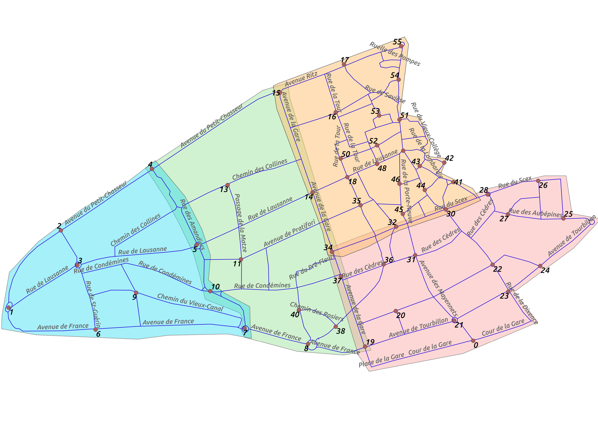

### Route inspection problem - use case of Sion (CH-VS)

In the context of the digitization of the city of Sion, an algorithm was needed to find the shortest path going along every **edge** at least once and forming a closed loop. This is a variation of the [directed Chinese Postman Problem](https://en.wikipedia.org/wiki/Route_inspection_problem) which aims to find the shortest path going through every **vertex** while forming a closed loop. 
As in the case of Sion the city cannot always be represented by an eulerian path, which leads to solving a NP-problem, a solution is proposed here, based on Hierholzer's algorithm (whose implementation was found [here](https://www.geeksforgeeks.org/hierholzers-algorithm-directed-graph/)).
It is modified to introduce directions in the graph (to represent one-way roads), randomization in the choice of vertices (to propose different solutions with similar costs) and a cost function (the weight of an edge increases when it is visited). 

The data used is based on the following representation of Sion, divided into 4 zones.

The *Hierholzer.py* code gives a list of labeled vertices as output, corresponding to the path to follow between crossroads of Sion.The xy coordinates of these crossroads in the EPSG:4326 referential are stored in *scan_nodes_XY.csv*. The list of GPS coordinates to follow is then stored in *directions.txt* and can be used with any web mapping service. 
